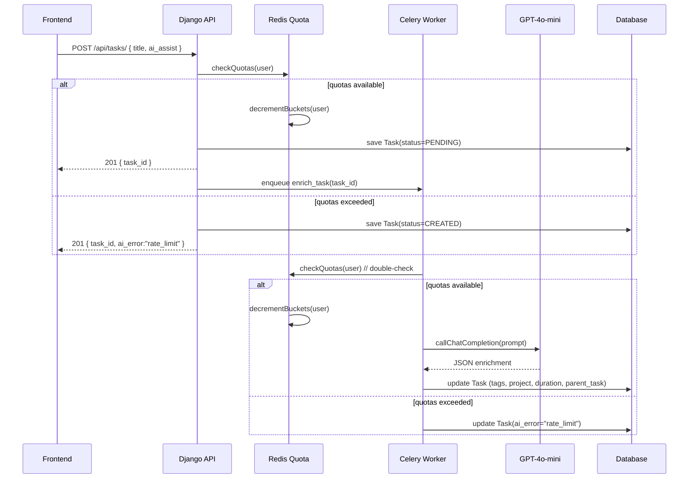

# AI Task Enrichment

This document details the end-to-end design of the AI Task Enrichment feature: how tasks are augmented with subtasks, tags, project suggestions, and duration estimates via GPT-4o-mini, while enforcing per-user rate limits and providing a seamless frontend experience.

---

## 1. Overview

- **Goal**: Minimize user effort by auto-filling empty Task fields when the AI-assist toggle is ON.
- **Augmented Fields**:
  - `parent_task` (self-referencing subtasks)
  - `tags` (0–2 items; can create one new tag)
  - `project` (must match an existing project)
  - `duration` (estimate like “10m” or “1h 30m”)
- **AI Model**: OpenAI GPT-4o-mini
- **Rate Limits**: Leaky‐bucket quotas per user:
  - 30 calls/minute
  - 60 calls/hour
  - 200 calls/day

---

## 2. Database Schema Changes

```sql
-- Task Model (backend/apps/core/models.py)
ALTER TABLE core_task
  ADD COLUMN parent_task_id INTEGER REFERENCES core_task(id) NULL;

-- Authentication Model (backend/apps/authentication/models.py)
ALTER TABLE authentication_user
  ADD COLUMN ai_assist_enabled BOOLEAN NOT NULL DEFAULT TRUE;
```

- **`parent_task`**: self-FK to group autogenerated subtasks under their root.
- **`ai_assist_enabled`**: user preference saved server-side (default ON).

---

## 3. API Endpoints & Payloads

### 3.1 Create Task

**Endpoint**
```
POST /api/tasks/
```

**Request JSON**
```jsonc
{
  "title": "Write marketing email for product launch",
  "description": "",
  "status": "BRAINDUMP",
  "ai_assist": true
}
```
- `ai_assist` (boolean): honor only if user’s `ai_assist_enabled` == `true`.

**Successful Response (HTTP 201)**
```json
{
  "id": 123,
  "title": "...",
  "description": "...",         // may be empty or enriched later
  "parent_task": null,
  "tags": ["email", "marketing"],
  "project": 45,
  "duration": "15m",
  "ai_error": null
}
```

**Rate-Limit Exceeded (HTTP 201)**
```json
{
  "id": 124,
  "title": "...",
  "ai_error": "rate_limit"
}
```
- The task is saved normally.
- Frontend must detect `ai_error == "rate_limit"` and disable the AI toggle.

---

## 4. Async Enrichment Flow



---

## 5. Rate-Limiter Design

- **Leaky‐Bucket** in Redis per user:
  - **Minute bucket**: capacity 30, refill 1 token every 2 seconds.
  - **Hour bucket**: capacity 60, refill 1 token every minute.
  - **Day bucket**: capacity 200, refill ~1 token every 7.2 minutes.
- **Key Structure**:
  - `quota:{user_id}:min`
  - `quota:{user_id}:hour`
  - `quota:{user_id}:day`

- **Algorithm**:
  1. On each AI call, attempt to remove 1 token from all three buckets.
  2. If any bucket is empty, abort and return rate-limit error.
  3. Refills happen when `now - last_refill` > interval; add `drip_rate * elapsed` tokens.

---

## 6. Frontend Behavior & UI

1. **AI Toggle**
   - Placed in header or “New Task” modal.
   - Persisted in Pinia and `localStorage`.
   - Default state loaded from user profile (`ai_assist_enabled`).

2. **Task Creation Flow**
   - User clicks “Save.”
   - If `ai_assist`==true, backend enqueues enrichment.
   - Frontend immediately displays the saved task.

3. **Polling for Enrichment**
   - Poll `/api/tasks/{id}` every 2 seconds, up to 8 times.
   - On each fetch, check enriched fields (`tags`, `project`, `duration`, `subtasks`).
   - Stop polling when enrichment completes or on final attempt.

4. **Error & Snackbar**
   - On response `ai_error == "rate_limit"`:
     - Disable AI toggle button.
     - Show a snackbar using `Snackbar.vue`:
       ```js
       addSnackbarItem(
         "AI enrichment limit reached. Try again later.",
         "OK",
         () => {},
         null,
         4000
       );
       ```

---

## 7. Prompt Templates

> **Guidelines**: Do not expose user ID/email. Only include task title, existing description, and lists of user’s project names and recent tags.

```text
You are a productivity assistant. Given:
- Task Title: "{title}"
- Existing Description: "{description}"
- User Projects: {project_names}
- User Recent Tags: {recent_tags}

Please output JSON with keys:
- "subtasks": Array of 3–5 concise strings
- "tags": Array of up to 2 tag names (may include one new)
- "project": existing project name or null
- "duration": estimated time, format "{H}h {M}m" or "{M}m"

Respond ONLY with valid JSON.
```

### Example Input
```json
{
  "title": "Plan Q3 marketing email campaign",
  "description": "",
  "project_names": ["Website Redesign", "Product Launch"],
  "recent_tags": ["email", "marketing"]
}
```

### Example Output
```json
{
  "subtasks": [
    "Draft email copy outline",
    "Design header image",
    "Configure email send list",
    "Schedule campaign in ESP"
  ],
  "tags": ["email", "campaign"],
  "project": "Product Launch",
  "duration": "20m"
}
```

---

## 8. Sequence & Flowcharts

```mermaid
flowchart TD
  A[User toggles AI:YES] --> B[POST /api/tasks/]
  B --> C{Rate-limit check}
  C -->|OK| D[Save Task, status=PENDING]
  C -->|LIMIT| E[Save Task, ai_error]
  D --> F[Enqueue Celery Job]
  F --> G{Rate-limit check}
  G -->|OK| H[Call GPT-4o-mini with prompt]
  G -->|LIMIT| I[Update Task(ai_error)]
  H --> J[Parse JSON & update Task fields]
  J --> K[Frontend polls & receives enriched Task]
  E & I --> L[Frontend shows rate-limit Snackbar]
```

---

_Every component—from database schema to frontend polling—ensures a robust, user-friendly AI enrichment capability while protecting against abuse and preserving user privacy._
